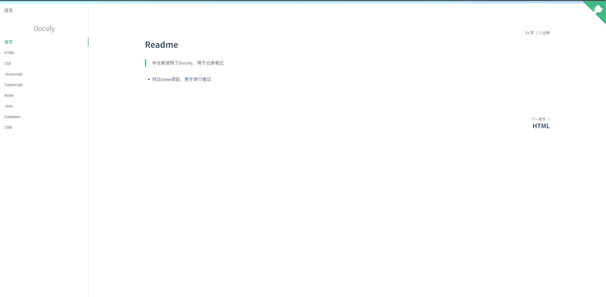
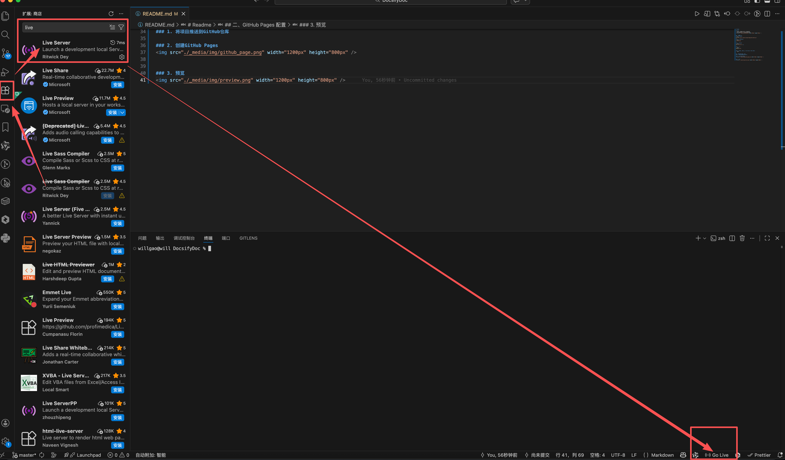
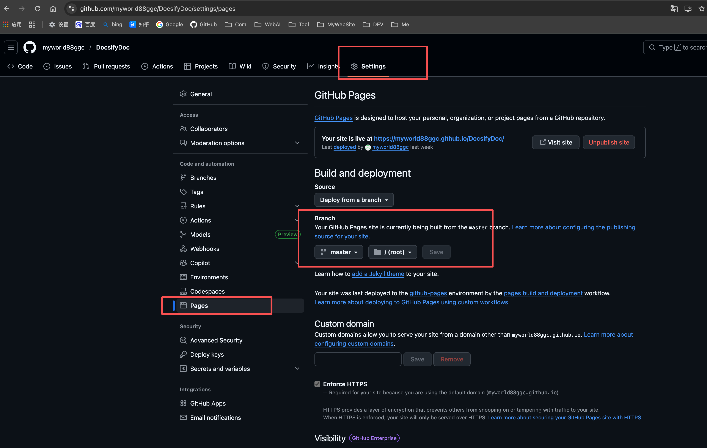
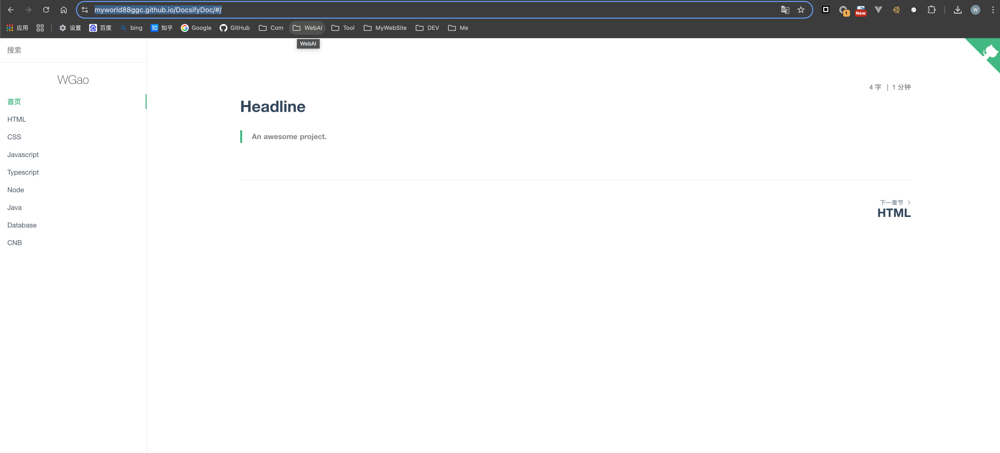

# Readme

## 介绍
> 本仓库使用了Docsify，用于记录笔记.
- 可以clone项目，使用markdown记录笔记
- Docsify 官方网站：[https://docsify.js.org/](https://docsify.js.org/#/zh-cn/)




## 一、快速开始
### 1. clone项目
```bash
git clone https://gitee.com/myworldggc/DocsifyDoc.git
```
### 2. 进入项目目录
```bash
cd DocsifyDoc
```

### 3. 安装依赖
```bash
npm i docsify-cli -g
```

### 4. 启动
#### 4.1 使用docsify启动
```bash
docsify serve
```

#### 4.2 VSCode安装Live Server
- 安装Live Server
- 安装后，VSCode右下角，点击Go Live




## 二、GitHub Pages 配置
### 1. 将项目推送到GitHub仓库

### 2. 配置GitHub Pages



### 3. 预览
